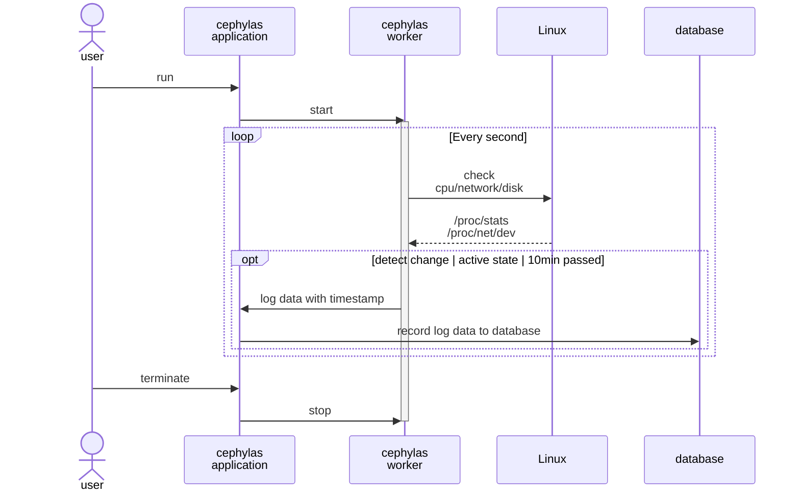

# Cephylas Telemetrer
Simple server load logging system for Linux systems,
written in Rust.

Cephylas comes from "cephonodes hylas", a kind of moth with clear wings.

## Memo

```mermaid
sequenceDiagram
    actor user
    participant app as cephylas<br/>application
    participant worker as cephylas<br/>worker
    participant os as Linux
    participant database as database

    user ->> app    : run
    app  ->> worker : start
    activate worker
    loop Every second
        worker ->> os  : check <br/>cpu/network/disk 
        os -->> worker : /proc/stats <br/>/proc/net/dev
        opt detect change | active state | 10min passed
            worker ->> app   : log data with timestamp
            app ->> database : record log data to database
        end
    end
    user ->> app : terminate
    app  ->> worker : stop
    deactivate worker
```
